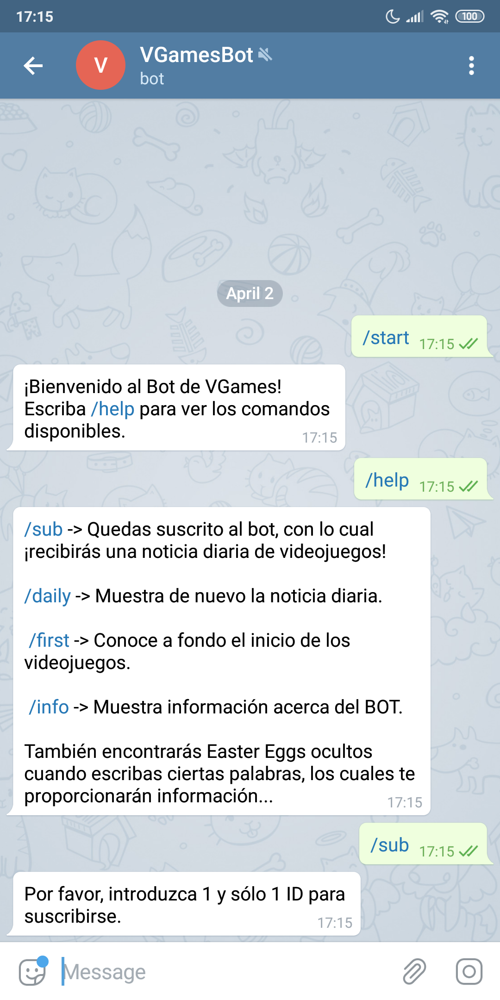
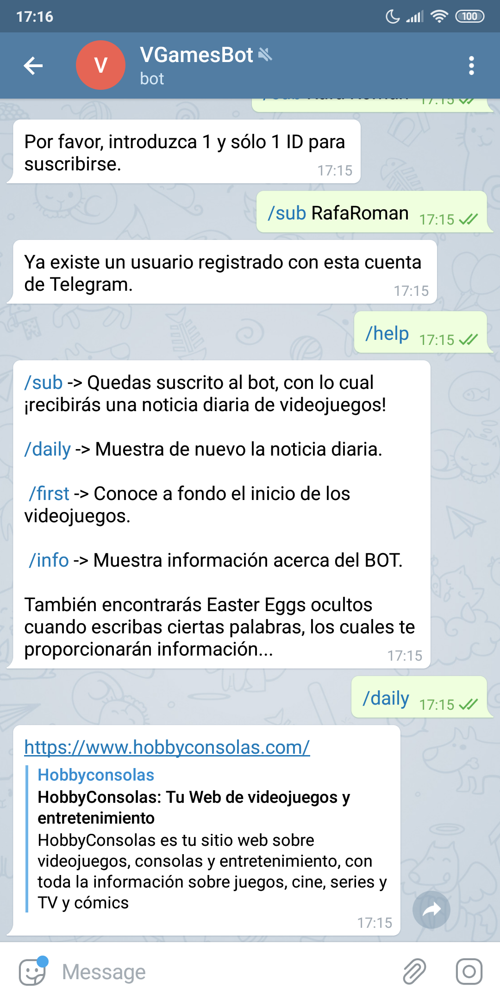

# VGamesBot
**Telegram Bot about Videogames for the subject Distributed Systems implemented on JSON and using AnyPointStudio**

The information source for this application is MongoDB which is a database system, oriented to open source documents. There we can create data collections, make *gets* and *posts* and more other actions. Web: https://www.mongodb.com/

## **Description**

This project consists in a Telegram bot who provides you information about videogames by a subscription (it is not stricted necessary to be subscribed).
The name of theis bot is **VGamesBot** and his ID is: **@VGames_RRA_bot**

Through the subscription any user will receive a videogame news and this will be chosen by the admin, who will send the news through a command in the bot.

Each one of the users can consult the daily news with no need of subscribe, just typing a command.

Also, I included some easter eggs and commands to extend the knowledge about videogames.

Before we get to explain the Anypoint Flow, i'm going to describe the commands:

- **/start**: returns a welcome message
- **/info**: show information about the creation of the bot and his developing.
- **/help**: list of the available commands.
- **/sub + "user with more than 3 characters"**: you get subscribed to the bot. You can only be subscribed once per Telegram account.
- **/daily**: show the daily news.
- **/first**: show images and a brief description of the first videogame ever created.
- **/adminDAILY + "link of the daily news"**: this commando is only available for the admin. This command receive the news, check the subscribed users and send it to them.

Easter Eggs:
  - When you write "pacman", we get to downlaod and visualize the video "Toru Iwatani, creador de Pac-Man, "comecocos" para los amigos" Source:  https://www.youtube.com/watch?v=jlQX_g9zCs8&t=106s
  
  - When you write "tetris" we get information about the game and the original soundtrack to download. Source:https://es.wikipedia.org/wiki/Tetris https://www.youtube.com/watch?v=9Fv5cuYZFC0

## **Anypoint Flow**

The first flow is for the **/sub** command, there we wait a POST of the application. As primary key in MongoDB we have the *chatid* of Telegram, because that form we will know if the user is already registered or not.

The second flow is for the **/adminDAILY** command, in this case we make a GET to obtain the list of registered users and know which one should receive the news.

## **Screenshots**

 

 

 
 

